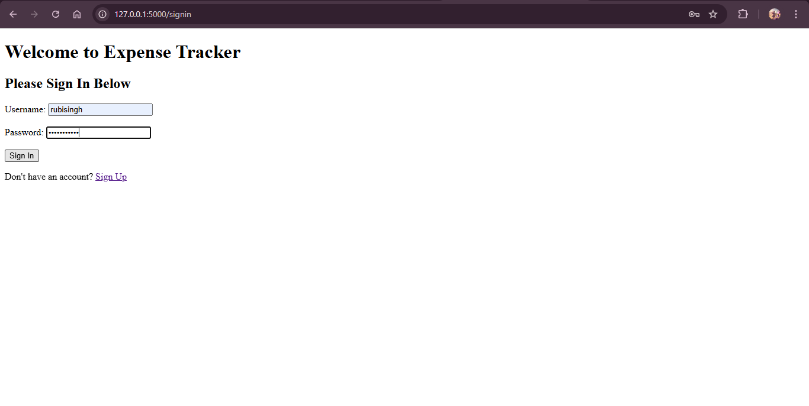
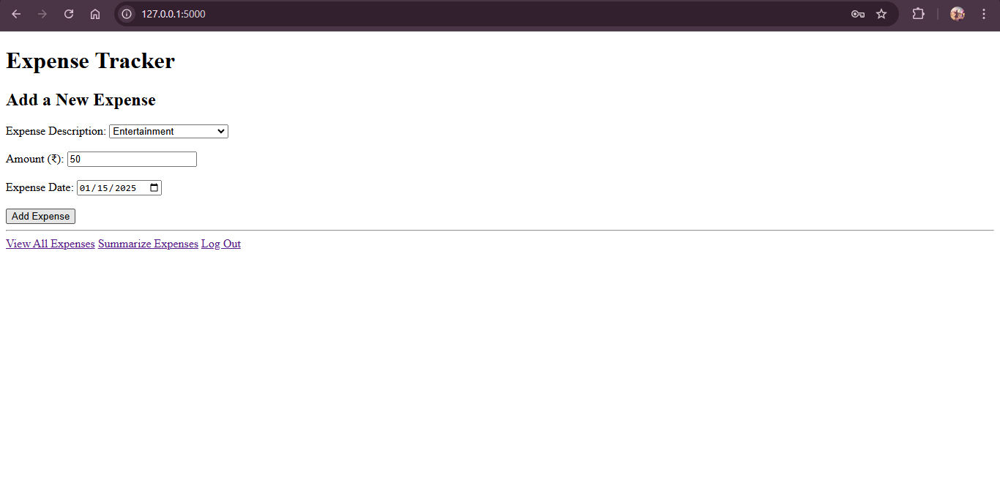
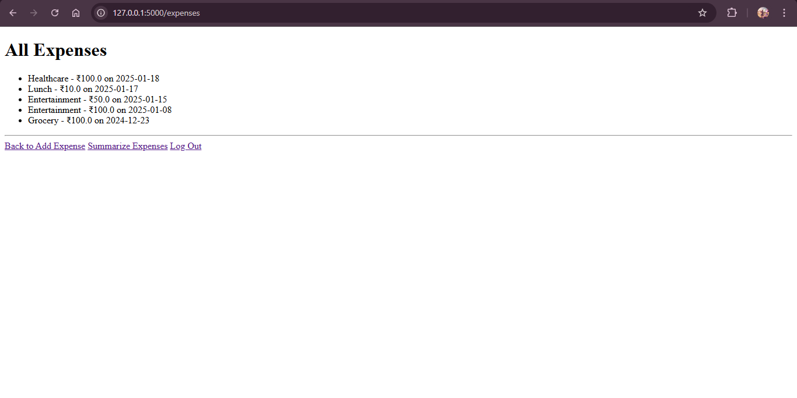
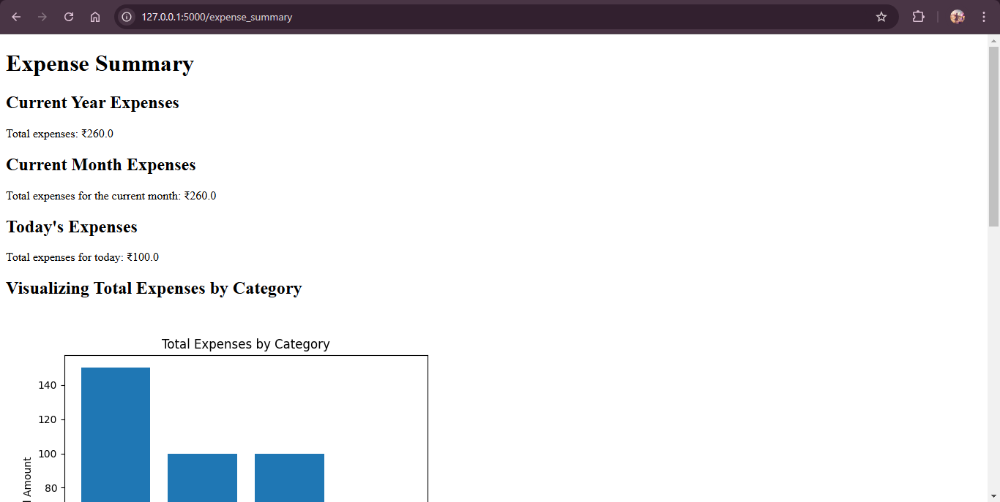
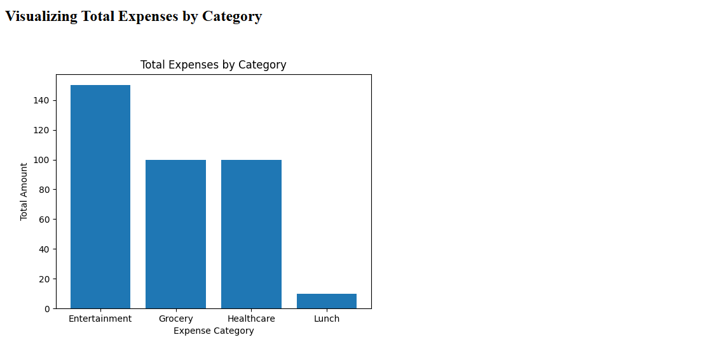
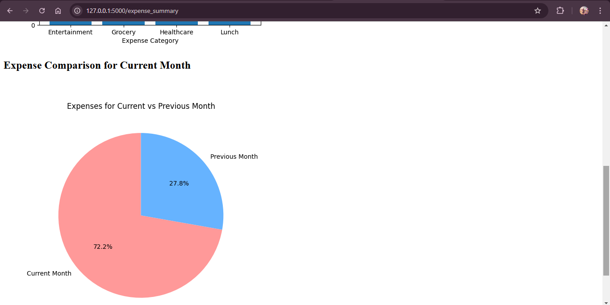

# ExpenseTracker

### Objective:
The **ExpenseTracker** project is a Flask-based backend application that allows multiple users to manage and track their expenses. It provides functionalities to add expenses, view expenses, and generate summarized details, including visual representations such as bar charts and pie charts.

---

### Project File Details:

- **expense.py**: Manages the expense object, which includes details like the description, date, and amount of the expense.
- **tracker.py**: Handles the addition of expenses, displays all expenses for a user, and provides a summary of expenses. It includes visual charts such as:
  - Category-wise expense bar chart
  - Pie chart comparing current and previous month expenses
  - Total expenses for the current year, month, and day
- **users.py**: Manages user registration and login functionalities.
- **main.py**: Serves as the entry point and central hub for the entire application to run.
- **templates/**: Contains HTML files for the user interface.
  - **index.html**: Page for adding new expenses.
  - **signin.html**: Page for user sign-in.
  - **signup.html**: Page for user registration.
  - **expenses.html**: Page to view all expenses of the user.
  - **summary.html**: Page to view the summary of expenses.

---

### How to Set Up the App:

1. **Clone the repository** or download the ZIP file and extract it.
2. Ensure the file structure looks like this:
    ```
    - expense.py
    - tracker.py
    - users.py
    - main.py
    - templates/
        - expenses.html
        - index.html
        - signin.html
        - signup.html
        - summary.html
    ```
3. **Create a virtual environment** for best practices:
    ```bash
    python -m venv env
    ```
4. **Activate the virtual environment**:
    - For Windows (Command Line):
      ```bash
      env\Scripts\activate
      ```
5. **Install the required dependencies**:
    ```bash
    pip install -r requirements.txt
    ```
6. **Run the application** by executing:
    ```bash
    python main.py
    ```

   After running, the app will start a Flask server on **localhost**. The default URL to access the app is:
   ```
   http://127.0.0.1:5000/
   ```

   Paste this URL into your browser to access the **ExpenseTracker** app.

---

### Features:

- **User Registration and Authentication**: New users can sign up, and existing users can sign in to track their expenses.
- **Expense Management**: Users can add and view their expenses.
- **Expense Summary**: Includes visual charts summarizing monthly, category-wise, and year-to-date expenses.
  
---

### Dependencies:

- Flask
- MongoDB
- Additional libraries (listed in `requirements.txt`)

---
### Example Usage:

1. **Sign up for a new user**:

   - When a new user visits the app, they will be prompted to sign up.
   - The signup page looks like this:

   

2. **Sign in to your account**:

   - After signing up, users can log in with their credentials on the signin page.
   - Here's how the signin page looks:

   

3. **Add a New Expense**:

   - Once logged in, users can add their expenses by filling in details like description, amount, and date.
   - The "Add Expense" page looks like this:

   

4. **View All Expenses**:

   - After adding expenses, users can view a list of all their expenses.
   - The page showing the list of expenses:

   

5. **Expense Summary**:

   - The app provides a summarized view of expenses with bar charts and pie charts.
   - Here’s a sample summary page showing category-wise expenses and a pie chart comparison between the current and previous month:

   
   
   

---
Enjoy managing your expenses with **ExpenseTracker**!